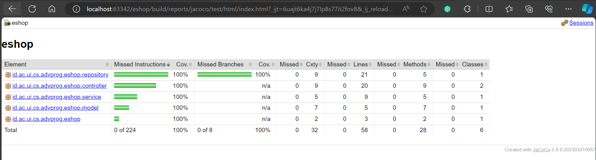

Link: https://tutorial-1-eshop-alifbintang.koyeb.app/
### SonarCloud Report

# Tutorial 2
## List Quality Code Issues
### 1. Renaming bad function name
Sebelumnya ada beberapa function yang menggunakan snake_case untuk penamaannya, yang mana seharusnya di Java best practice-nya menggunakan camelCase. Maka, saya mengganti semua method yang awalnya menggunakan snake_case menjadi camelCase.

### 2. Removing unnecessary imports
Sebelumnya ada beberapa import yang tidak digunakan, maka saya menghapus import yang tidak digunakan tersebut.

### 3. Removing public access modifier in interface class
Sebelumnya ada beberapa interface yang menggunakan public access modifier, yang mana seharusnya tidak perlu ada access modifier di interface (karena default-nya sudah public). Maka, saya menghapus public access modifier di interface tersebut.

## Current Implementation Has Met the Definition of CI/CD

Menurut saya, dengan penerapan saat ini sudah memenuhi konsep CI/CD. Dengan alur kerja yang diselenggarakan melalui GitHub Workflows, proyek kita dapat mengotomatiskan proses CI dengan menjalankan uji coba dan CD dengan melakukan deployment secara otomatis setiap kali ada pembaruan yang diunggah ke repositori GitHub. Setiap kali ada pembaruan di branch mana pun, kode akan melewati serangkaian uji coba yang ditentukan dalam file ci.yml dan akan di-scan oleh PMD melalui aksi yang tercantum. Setelah dianggap berhasil dan berkualitas, kode kita akan di-merge ke branch main di mana proses deployment ke PaaS Koyeb dan penerapan code security menggunakan scorecard.yml akan dilakukan secara otomatis. Dengan demikian, action-action tersebut membentuk workflows otomatis pada Software Development Lifecycle yang terdapat juga CI/CD.

## Bonus

# Tutorial 1
## Exercise 1
### Implementasi prinsip clean code pada tugas:
#### 1. Meaningful Names
- Menggunakan nama variabel yang jelas sesuai tujuannya, seperti `productId`, `productName`, dan `productQuantity` yang merujuk ke ID, nama, dan kuantitas produk secara berurutan.
- Menggunakan nama fungsi yang jelas sesuai tujuannya, seperti `create`, `edit`, dan `delete` yang merujuk ke function untuk membuat produk, mengedit nama/kuantitas produk, dan menghapus produk.

#### 2. Functions
- Prinsip "Function should do one thing. They should do it well. They should do it only." yang ditunjukkan pada fungsi `create`, `edit`, dan `delete` yang hanya melakukan satu tujuan saja.
- Prinsip "Function should be small" yang ditunjukkan pada fungsi `create`, `edit`, dan `delete` yang memiliki kode yang tidak terlalu panjang.
- Prinsip "Function should have no side effects" yang ditunjukkan pada fungsi `create`, `edit`, dan `delete` yang tidak memiliki efek samping.

#### 3. Comments
- Prinsip "Don't comment bad code, rewrite it" yang ditunjukkan pada kode yang tidak memiliki komentar karena kode sudah bersih dan mudah dipahami.

### Improve kesalahan code pada tugas:
ID produk yang belum di-generate yang menyebabkan produk yang telah dibuat tidak bisa di-edit/di-delete. Solusinya adalah setiap kali produk dibuat, saya langsung meng-generate ID produk tersebut dengan random UUID.

## Exercise 2
### Implementasi unit test pada program
- Setelah menulis unit test, saya merasa lebih yakin tentang keandalan kode yang telah dibuat karena unit test membantu menjamin bahwa fungsi yang diuji berjalan sesuai yang diharapkan.

- Tidak ada aturan baku tentang berapa banyak unit test yang harus dibuat untuk sebuah class, tetapi sebaiknya minimal mencakup skenario penggunaan umum.

- Untuk memastikan bahwa unit test sudah cukup untuk memverifikasi program, kita harus paham apa saja semua kasus yang mungkin terjadi. Unit test harus mencakup berbagai kemungkinan dan memastikan bahwa setiap bagian dari kode di-test dengan baik.

- Code coverage adalah metrik yang membantu mengukur sejauh mana kode sumber kita diuji oleh unit test. Meskipun memiliki 100% code coverage, bukan berarti program tidak memiliki bug. Code coverage hanya memberikan gambaran sejauh mana kode telah diuji, tetapi tidak menjamin bahwa setiap kemungkinan skenario telah di-cover.

### Implementasi functional test pada program
Jika saya membuat functional test yang mirip dengan functional test yang sudah ada, akan ada potensi masalah cleanliness code.
- Dapat terjadi duplikasi kode yang tidak perlu karena setup procedures dan instance variables mirip atau sama dengan test suite sebelumnya. Sebaiknya perlu dilakukan pertimbangan penggunaan metode atau kelas utilitas untuk merinci logika setup yang umum di antara test suite.
- Dapat terjadi kasus function yang tidak sesuai dengan tujuannya. Terlalu banyak logika yang kompleks dapat membuat test suite sulit dimengerti dan rentan terhadap bug. Sebaiknya perlu dipastikan bahwa setiap metode atau langkah di dalam test suite memiliki tujuan yang jelas dan sesuai dengan pengujian jumlah item dalam daftar produk.

Untuk meningkatkan code cleanliness, perlu digunakan prinsip DRY (Don't Repeat Yourself) dengan membuat metode bantu atau kelas utilitas jika ada kode yang sering digunakan. Juga, perlu dipastikan bahwa nama variabel, metode, dan kelas sesuai dengan konvensi penamaan yang disepakati untuk meningkatkan keterbacaan.